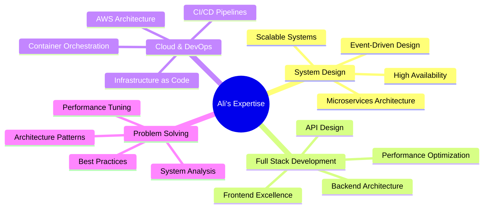

<div align="center">
  
</div>

<h1 align="center">
  
</h1>

<div align="center">
   
  
</div>

<br/>

<div align="center">
  
```javascript
const ali = {
  title: "Full Stack Developer & Cloud Architect",
  passion: "Turning Complex Problems into Elegant Solutions",
  code: ["JavaScript", "TypeScript", "Python", "C++"],
  expertise: {
      frontend: ["React", "Next.js", "Redux", "Tailwind CSS"],
      backend: ["Node.js", "Express", "NestJS", "Django"],
      cloud: ["AWS", "Docker", "Kubernetes", "Jenkins"],
      architecture: ["Microservices", "Event-Driven", "DDD", "TDD"],
      databases: ["MongoDB", "PostgreSQL", "Redis", "MySQL"]
  },
  currentFocus: "Building scalable, resilient microservices architectures",
  funFact: "I debug in my dreams and wake up with solutions! 🚀"
};
```

</div>

<h2 align="center">💫 About Me</h2>

<p align="center">
  🎯 I'm a problem-solving enthusiast who loves architecting complex systems<br/>
  🏗️ Expert in designing scalable microservices architectures<br/>
  ☁️ Cloud & DevOps specialist with extensive AWS experience<br/>
  🚀 Passionate about optimizing system performance and scalability<br/>
  🎨 Converting business requirements into elegant technical solutions<br/>
  🔄 Advocate for continuous learning and technological innovation
</p>

<div align="center">
  
</div>

<h2 align="center">🛠️ Tech Arsenal</h2>

<details align="center">
<summary><b>🎨 Frontend Mastery</b></summary>
<br/>

<br/>
<i>Building responsive and intuitive user interfaces with modern frameworks and tools.</i>
</details>

<details align="center">
<summary><b>⚙️ Backend Excellence</b></summary>
<br/>

<br/>
<i>Crafting robust and scalable server-side applications with focus on performance.</i>
</details>

<details align="center">
<summary><b>☁️ DevOps & Cloud Infrastructure</b></summary>
<br/>

<br/>
<i>Orchestrating seamless deployments and maintaining high-availability systems.</i>
</details>

<details align="center">
<summary><b>🛢️ Database & Caching</b></summary>
<br/>

<br/>
<i>Managing data with efficiency and implementing optimal caching strategies.</i>
</details>

<h2 align="center">🎯 Expertise Highlights</h2>



<h2 align="center">📈 GitHub Activity</h2>

<p align="center">
  
</p>

<p align="center">
  
</p>

<h2 align="center">🤝 Let's Connect</h2>

<div align="center">
  <a href="https://linkedin.com/in/yourusername">
    
  </a>
  <a href="mailto:your.email@example.com">
    
  </a>
  <a href="https://github.com/Alitariq-code">
    
  </a>
</div>

<div align="center">
  <h3>💼 Open for exciting opportunities and collaborations!</h3>
  <p>Let's build something amazing together! 🚀</p>
</div>

<div align="center">
  
</div>
